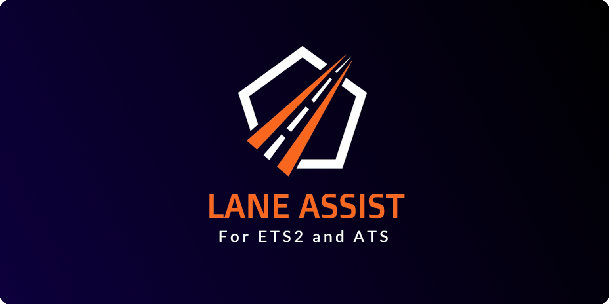

# ETS2LA
This app has matured enough that we will need a name change soon... you can submit any ideas to me on discord 👍
You can see the candidates so far at my [kanboard page.](https://kanboard.tumppi066.fi/public/task/52/b119efc6029af19e58ed53dc4eb30ee8dbdc44095e84d2d597ba8a81657b)
### Links

Discord: https://discord.gg/DpJpkNpqwD

Youtube: https://www.youtube.com/@tumppi066

Wiki: https://wiki.tumppi066.fi/en/LaneAssist

Documentation (VERY WIP & AUTOGENERATED): https://docs.tumppi066.fi

### About

What is this app?
1. It's a lane assist software for ETS2 and ATS. I am also working on making it fully (well almost) autonomous.
2. Along the way I developed it to a complete plugin based application for sending information to and from ETS2 and ATS.
    - This means that you can create your own plugins for the app, even if they are not related to driving.

### What does it look like in action?

Check the demonstration [video](https://www.youtube.com/watch?v=4F5u0B70pAw).

### How do I install it?

You can watch the latest installation [video](https://www.youtube.com/watch?v=0pic0rzjvik&t=1s). Downloading and installing takes about 20 minutes. And then another 10 to tune in your own values.
Alternatively you can also follow the written instructions on the [wiki](https://wiki.tumppi066.fi/en/LaneAssist). Keep in mind that both the video and the wiki might not be up to date!

### How to update?

You can run the update.bat script or go into `app/` and run `git pull`.
The app will also automatically give a prompt when an update is available.

### How to contribute?

You can contribute by creating plugins for the app, in addition to editing already existing ones.
Those not familiar with github should do as follows:
1. Fork the repository
2. Make your changes in your fork
3. Make a pull request to merge the changes to the public version.

The plugin infrastructure has documentation on the [wiki](https://wiki.tumppi066.fi/en/LaneAssist).

### I have issues / suggestions.

Please join the [discord](https://discord.gg/DpJpkNpqwD) or make an issue here. Keep in mind that I am more active on the discord, and the issue you face might already have an answer there. 

### I want to support you.

### I want to use your app in my own app.

The license does indeed allow you to do that. As long as you keep all the copyright notices in place. Despite this I would appreciate if you did at least tell me about it. I'm eager to help anyone wanting to use my code and I will share my knowledge.

In addition it would be beneficial if you made a plugin instead of just copying the code. This way you can update the plugin without having to update the whole app.
To add to this I will try and implement all the additional backend features you want (for example more UI shortcuts etc...).

