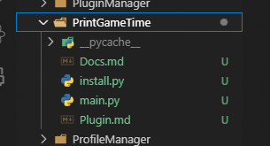
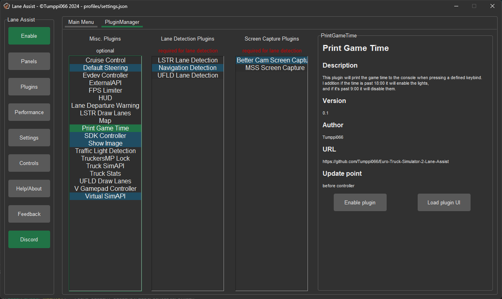
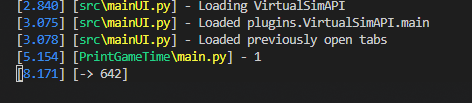
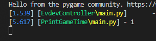
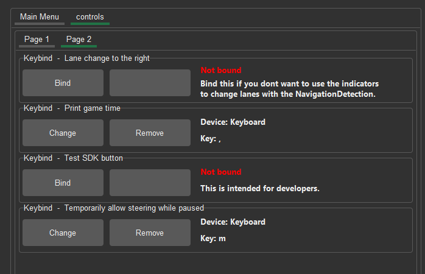

### Introduction
This tutorial page will run you through the creation of a simple plugin that will output the current value of the in game time. 
We will also be sending information to the game, and reading a control value from the user.

[!badge variant="warning" text="This page is WIP and not yet complete!"]

### The plugin framework
The plugin framework of ETS2LA is fairly simple. All plugin live in the /plugins folder, these are loaded by the program when it starts up.

Here's some stuff to note on the file and code structure:
+++ File structure

```
plugins
├─── plugin
│   ├─── main.py
│   ├─── installer.py
│   ├─── plugin.md
│   ├─── docs.md
```

==- [!badge variant="dark" text="Required"] ‎ main.py
This is the main file of the plugin. It will be imported once the program starts up. 
!!! Note
You can obviously have other files, but everything must start or be imported from main.py. More on this in the code structure section.
!!!

==- [!badge variant="dark" text="Required"] ‎ installer.py
This file is used when the application discovers the plugin for the first time. It usually contains code for installing pip packages, this is included in the example installer.py.

==- [!badge variant="ghost" text="Optional"] ‎ plugin.md
This file contains the information displayed on the left side of this page. It is written in markdown, and is parsed by the application. 
**The name of this file must match the name of the folder it's in.**
!!! Note
Documentation can be found on the [retype website](https://retype.com).
!!!

==- [!badge variant="ghost" text="Optional"] ‎ docs.md
This file on the other hand contains information for developers, it will be opened by the button located in the plugin.md file. This is also included in the example plugin.
==-

+++ Code structure

The program includes some predefined functions. These are used by the main program loop to send extra information to the plugin.

==- [!badge variant="dark" text="Required"] ‎ `PluginInfo = PluginInformation()`
This is the class that contains information about the plugin. It is used by the program to display information about the plugin in the plugin manager.

**The plugin example will contain almost everything you need.**

!!! Note
You can check the current state of the file [on the documentation page](https://wiki.ets2la.com/docs/plugins/plugin.html).
!!!

==- [!badge variant="dark" text="Required"] ‎ `plugin(data)`
**This is the main function of the plugin.**
It will be run every frame, and the current program data `dictionary` will be passed on to it. 
!!! Note
It is paramount that you return the `data` variable! 
Don't worry, the program will shout at you if you forgot :+1:
!!!

==- [!badge variant="ghost" text="Optional"] ‎ `onEnable()`
This function is called in two cases:

1. When the plugin is enabled and loaded at startup
2. When the plugin is enabled through the plugin manager

This is useful if you for example have to do some heavy calculations. We don't want those calculations unnecessarily running when starting up. Thus they will run only when the plugin is actually enabled.

==- [!badge variant="ghost" text="Optional"] ‎ `onDisable()`
This function is called when the plugin is disabled. This is useful for cleaning up any resources that the plugin might have used.


==- [!badge variant="ghost" text="Optional"] ‎ `class UI()`
This class is used to create UI for the plugin. We will be using this later on, and it will be explained in more detail then.

==-

+++

### How to create plugin?
!!! Note
I will be using visual studio code going forward. You can use any editor you want, but vs code is free and lightweight so I'm going with it. As long as you are not just using notepad you'll be absolutely fine.
!!!
Creating plugins is actually really simple. 
I have included templates for both plugins and panels *(going to be explored later)* in the `plugins/Examples/.` folder.

+++ Step 1
#### Creating the plugin.
The first step is cloning that example plugin folder and renaming it to something else, I will use `PrintGameTime` as an example.


This way we will have all the required files and templates ready to go, making the process a lot easier and quicker.

+++ Step 2
#### Customizing PluginInfo.
Now we will want to configure the plugin information. To do this, open the main.py file, and edit the `PluginInfo` class.
```python
PluginInfo = PluginInformation(
    name="PrintGameTime", # This needs to match the folder name under plugins (this would mean plugins\Plugin\main.py)
    # In case the plugin is not the main file (for example plugins\Plugin\Plugin.py) then the name would be "Plugin.Plugin"
    
    description="This plugin will print the game time to the console when pressing a defined keybind.\nI addition if the time is past 18:00 it will enable the lights,\nand if it's past 9:00 it will disable them.",
    version="0.1",
    author="Tumppi066",
    url="https://github.com/Tumppi066/Euro-Truck-Simulator-2-Lane-Assist",
    type="dynamic", # = Panel
    dynamicOrder="before controller" # Will run the plugin before anything else in the mainloop (data will be empty)
)
```
Here all I've is configure the name, description, version, author and url.

Now when you start the app, without doing anything else you should see the installer come up, and then the plugin will be available in the plugin manager.


!!! Note on dynamicOrder
This defines where in the apps main loop cycle the plugin will be run. Since we want to send data to the game, we will run before the controller.
All available options are:
1. `before image capture` / `image capture`
2. `before lane detection` / `lane detection`
3. `before controller` / `controller` 
4. `before game` / `game`
5. `before UI`
6. [!badge variant="info" text="Reserved for the fps limiter!"] ‎ `last`
!!!

+++ Step 3
#### Getting data from the game.
Now we are at the fun part!

We get to start writing the actual code for the plugin in question. Remember how all plugin code should be in the `plugin(data)` function? Well that's where we are going to start.
```python
def plugin(data):
    gameTime = data["api"]["time"]
    print(gameTime)
    return data
```
- 
Seems like it's working!
Do note that it's printing only 1s because I'm using the `VirtualSimAPI` here. It's convenient since I don't have to have the game open to test the plugin.  

!!! Note
You can use the UI of the `TruckSimAPI` plugin to check what data is available at what data path.
!!!

+++ Step 4
#### Get user inputs.
Now that we have the time printing to the console, we can assign a keybind to it.
For this we can use the already imported [src.controls](../src/controls.md) module.
```python
# Register a keybind. defaultButtonIndex is the default keybind, if a string is passed it will be a keyboard event.
controls.RegisterKeybind("Print game time", defaultButtonIndex=",")
lastPressed = False
def plugin(data):
    global lastPressed
    gameTime = data["api"]["time"]
    
    # Check if the keybind is pressed.
    if controls.GetKeybindValue("Print game time"):
        if not lastPressed:
            lastPressed = True
            print(gameTime)
    elif lastPressed:
        lastPressed = False
            
    return data
```
This is fairly simple too. What we can check now is that the keybind is working as intended, and we can change it in the settings.
- 

Seems like it's working!
Now let's check the controls menu.
- 

It was put on the second page, but our keybind is indeed there. Now the user can change it to whatever they want.

!!! Note on keybinds.
You can also get a float value from a controller. To do this add `axis=True` to the RegisterKeybind function. 
For more info on the controls module, check out the [controls page](https://wiki.ets2la.com/docs/src/controls.html).
!!!
+++ Step 5
#### Sending data to the game.
WIP
+++